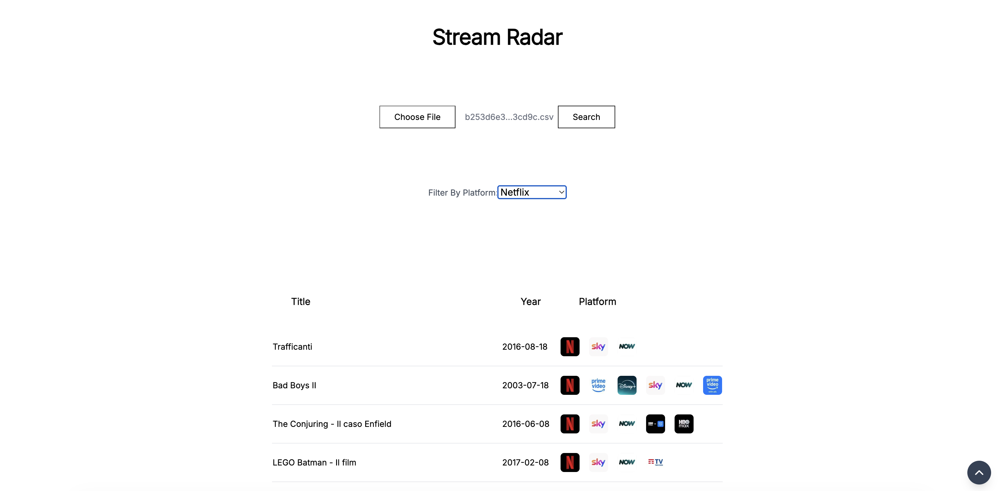

# StreamRadar 
Find out which films from your IMDB watchlist are available on Italian streaming platforms.

## Screenshots

## Usage ▶️
1. Export your IMDB watchlist as a CSV from imdb.com
2. Upload the CSV file
3. Click Search and wait for results
4. Filter by platform to find what to watch tonight

## Tech Stack 🛠
- React, TypeScript, TailwindCSS
- PapaParse for CSV parsing
- TMDB API for streaming data
- Vite

## Contributing 🤝
This project is still a work in progress. Contributions and suggestions are welcome!

🌐 Live demo: https://streamradarimdb.netlify.app/
